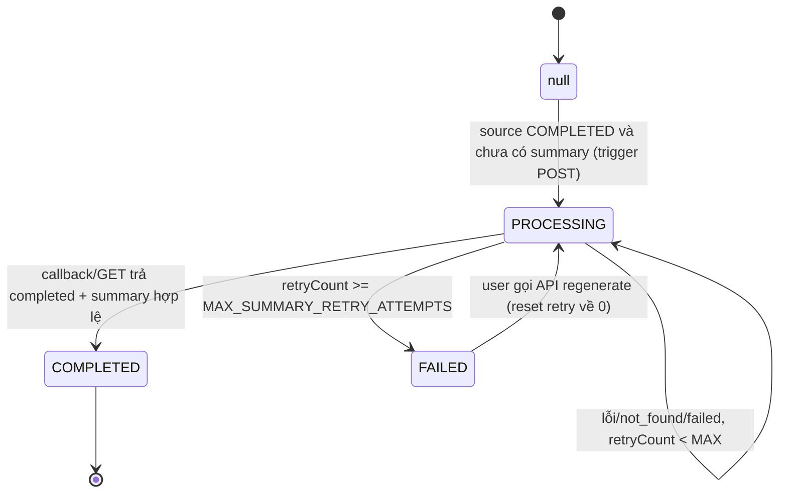

# Tính năng: Tối ưu prompt AI (tiêu đề, rolling summary, source-guide)

## Mục đích

Cải thiện chất lượng và độ ổn định của các tác vụ **sinh văn bản bằng AI** trong core-service,
đặc biệt khi backend dùng **model nhỏ / reasoning model** như `gpt-oss-20b` — nhóm model
rất dễ:

- trả về kèm **phần suy luận** (`<thinking>...</thinking>`, `Thought:`...) dù prompt đã yêu cầu
  chỉ trả nội dung;
- thêm **nhãn/câu dẫn** (`Title:`, `Summary:`, "Dưới đây là...");
- trả **sai ngôn ngữ** so với tài liệu nguồn;
- **bịa thêm** thông tin không có trong dữ liệu vào;
- sinh summary **phình to** dần theo thời gian.

## Phạm vi thay đổi

| Tác vụ | Nơi gọi | Prompt tập trung |
|--------|---------|------------------|
| Sinh tiêu đề note | `NoteService#resolveTitle` → `RagService#generalTitleOfNote` | `AiPromptTemplates#titlePrompt` |
| Sinh tiêu đề topic | `RagService#asyncUpdateTopicTitle` → `generalTitleOfTopic` | `AiPromptTemplates#titlePrompt` |
| Rolling summary Topic | `RagService#asyncUpdateTopicSummary` | `AiPromptTemplates#topicSummaryPrompt` |
| Rolling summary Notebook | `RagService#asyncUpdateNoteBookSummary` | `AiPromptTemplates#noteBookSummaryPrompt` |
| Source-guide summary (NotebookLM) | `NoteBookSourceService#triggerSourceGuideForSource` | `NotebookSourceSummaryConfig#SUMMARY_GENERATION_INSTRUCTION` |

## Nguyên tắc thiết kế prompt

1. **Tách chỉ dẫn và dữ liệu**: nội dung đầu vào bọc trong `<<<INPUT ... INPUT>>>`,
   `<<<EXISTING_SUMMARY ... EXISTING_SUMMARY>>>`, `<<<NEW_MESSAGES ... NEW_MESSAGES>>>`
   → model nhỏ không nhầm nội dung người dùng với luật.
2. **Mỗi luật một dòng riêng**: bản cũ nối chuỗi thiếu `\n` khiến `### Constraints:` dính
   liền nhau thành `...constraints:### Constraints:- Language:...`, rất khó parse với model nhỏ.
3. **Output contract tường minh**: "chỉ trả về DUY NHẤT nội dung", "không trình bày quá trình
   suy luận", "không thêm `<thinking>`".
4. **Ngân sách độ dài** cho cả input lẫn output.
5. **Chống bịa**: cấm thêm thông tin không có trong dữ liệu đầu vào.

## Cơ chế bảo vệ khi runtime

### 1. Cắt ngắn input (`AiTextSanitizer#truncate`)

| Setting | Default | Ý nghĩa |
|---------|---------|---------|
| `ai.title.maxInputChars` | 2000 | Ngân sách ký tự cho input sinh tiêu đề |
| `ai.summary.maxInputChars` | 12000 | Ngân sách ký tự cho block hội thoại khi nén summary |
| `ai.summary.maxWords` | 300 | Số từ tối đa của summary đầu ra |

Ngoài ra mỗi tin nhắn riêng lẻ bị chặn ở `DEFAULT_MESSAGE_MAX_CHARS = 1500` ký tự.
Khi block vượt ngân sách, **tin nhắn cũ nhất bị lược bớt** (giữ tin nhắn gần nhất) và
**checkpoint chỉ tiến tới tin nhắn cuối thực sự được đưa vào prompt** — phần bị lược sẽ
được tóm tắt ở lần chạy sau thay vì mất ngữ cảnh vĩnh viễn.

### 2. Temperature tất định

Tác vụ phụ trợ (sinh tiêu đề, nén summary) force `temperature = 0.2` (`DETERMINISTIC_TEMPERATURE`)
thay vì dùng `ai.temperature` (mặc định 0.7 của chat). Temperature cao khiến model nhỏ
sinh tiêu đề lan man, thêm lời dẫn, bịa chi tiết. `ai.model` và `ai.maxTokens` vẫn áp dụng bình thường.

### 3. Làm sạch output (`AiTextSanitizer#sanitize`)

Loại bỏ trước khi lưu DB / trả client:

- Khối suy luận: `<thinking>`, ` thinking`, `<reasoning>`, `<analysis>` (có thẻ đóng).
- Nhãn suy luận đầu chuỗi: `Thought:`, `Reasoning:`, `Phân tích:`, `Suy luận:`.
- Nhãn kết quả: `Title:`, `Tiêu đề:`, `Summary:`, `Tóm tắt:`, `Final summary:`.
- Câu dẫn: `Here is the title:`, `Below is...`, `Dưới đây là...`.
- Đuôi bịa thêm: `Let me know if...`, `Hope this helps`, `Hy vọng...`.
- Dấu nháy/backtick/ngoặc kép unicode bao quanh.
- Với tiêu đề: gộp về một dòng, bỏ markdown heading/bullet và dấu câu kết thúc.

## Source-guide summary (NotebookLM) — vòng đời mới

Trước đây `syncCompletedSourceGuides` quét mọi source `COMPLETED` thiếu summary rồi poll GET
**không giới hạn**, khiến source mà RAG service không bao giờ trả được guide (trigger lỗi, hoặc
source tạo trước khi bật tính năng) bị poll mãi mỗi phút.

Trạng thái mới (`NotebookSourceEntity.SummaryStatus`):

- Cột DB mới: `summary_status`, `summary_retry_count`, `summary_error` (Flyway `V32`).
- `MAX_SUMMARY_RETRY_ATTEMPTS = 5` (mặc định), chỉnh được qua setting `ai.sourceGuide.maxRetryAttempts`.
- **Callback `failed` tăng retry count** — nếu không tăng thì source kẹt ở PROCESSING, scheduler poll vô hạn (bug đã fix).
- Callback `completed` nhưng summary rỗng cũng tính là một lần thất bại.
- Khi GET trả `not_found` (RAG service mất state) → **re-trigger POST** thay vì poll vô ích.
- Summary nhận được từ callback/GET/ingestion `/summarize` đều đi qua `AiTextSanitizer#sanitize` trước khi lưu.
- `summary_error` lưu lý do lỗi gần nhất (chặn ở 1000 ký tự) để debug không cần tra log.
- `NoteBookSourceResponseDto` expose thêm `summaryStatus` để FE hiển thị spinner/cảnh báo.

## API regenerate summary

`POST /user/notebooks/{noteBookId}/sources/{sourceId}/source-guide/regenerate`

- Dùng khi summary `FAILED` (cạn retry) hoặc user muốn làm mới nội dung.
- Reset `summaryRetryCount = 0`, đánh dấu `PROCESSING`, trigger lại POST với
  `forceRegenerate = true` nếu source đã có summary (bắt RAG service sinh lại thay vì trả cache).
- Từ chối nếu source chưa hoàn thành embedding (`NOTEBOOK_SOURCE_NOT_COMPLETED`, code 1200).
- Có `@Audited` để theo dõi hoạt động này.

## Clamp độ dài đầu ra

Model nhỏ hay phình to output dù prompt đã giới hạn số từ. `AiTextSanitizer#sanitize(raw, collapseToOneLine, maxLength)`
chặn độ dài cuối cùng:

- Tiêu đề: clamp cứng 15 từ (~105 ký tự).
- Rolling summary: clamp theo `ai.summary.maxWords` (× ~7 ký tự/từ).
- Cắt tại ranh giới khoảng trắng, thêm `...` — không chém giữa từ tiếng Việt có dấu.

## Cấu hình linh hoạt (System Settings)

| Setting | Default | Ý nghĩa |
|---------|---------|---------|
| `ai.title.maxInputChars` | 2000 | Ngân sách ký tự input sinh tiêu đề |
| `ai.summary.maxInputChars` | 12000 | Ngân sách ký tự block hội thoại khi nén summary |
| `ai.summary.maxWords` | 300 | Số từ tối đa của summary đầu ra |
| `ai.sourceGuide.maxRetryAttempts` | 5 | Số lần thử source-guide tối đa trước khi FAILED |
| `ai.sourceGuide.generationInstruction` | (chuỗi mặc định) | Chỉ dẫn sinh summary gửi kèm khi trigger |

Quy ước: giá trị `<= 0` hoặc rỗng → dùng default trong code. Admin chỉnh qua UI System Settings
(`isPublic=false`, nhóm AI), không cần deploy lại.

## Request source-guide mở rộng

`RagSourceGuideRequestDto` thêm 2 field (gửi lên RAG service):

- `language` — lấy từ setting `system.language`, tránh trả sai ngôn ngữ.
- `generation_instruction` — chỉ dẫn tone/cấu trúc/độ dài cho model.

> ⚠️ Cần RAG service hỗ trợ 2 field này để phát huy hiệu quả; nếu RAG service bỏ qua thì
> không gây lỗi (contract vẫn tương thích ngược).

## Cấu trúc code

| Layer | File |
|-------|------|
| Prompt templates | `ai/constant/AiPromptTemplates.java` |
| Source-guide config | `ai/constant/NotebookSourceSummaryConfig.java` |
| Text sanitizer | `ai/util/AiTextSanitizer.java` |
| Sinh văn bản | `ai/service/RagService.java` |
| Source-guide lifecycle | `ai/service/NoteBookSourceService.java` |
| Migration | `db/migration/V32__add_notebook_source_summary_tracking.sql`, `V33__add_ai_generation_settings.sql` |

## Kiểm thử thủ công

1. Tạo note **không truyền title** với nội dung dài → title trả về 1 dòng, không có `"Title:"`,
   không có nhãn câu dẫn.
2. Chat topic đến khi vượt `recentWindow + minMessagesToCompress` → kiểm tra
   `topic.conversation_summary` không chứa `<thinking>`, không bắt đầu bằng "Dưới đây là".
3. Upload source vào notebook → theo dõi `notebook_sources.summary_status` chuyển
   `PROCESSING → COMPLETED`; nếu RAG service lỗi liên tục thì sau 5 lần chuyển `FAILED`
   và scheduler **dừng poll** source đó.
4. Cố ý trả về summary rỗng với `status=completed` → phải ghi nhận retry và không lưu summary rỗng.
