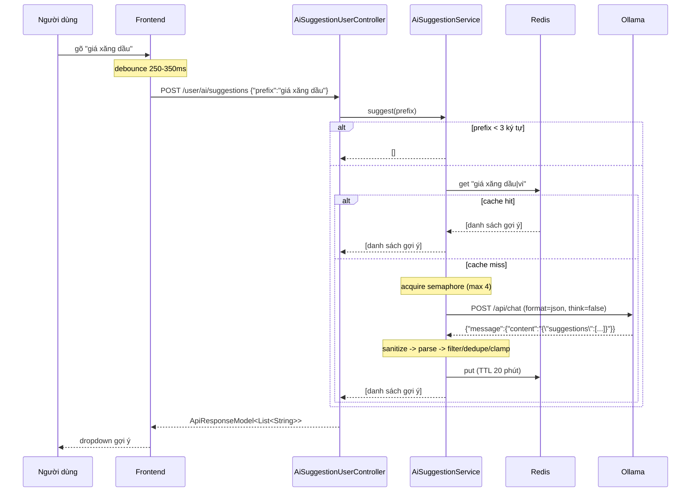

# AI Question Autocomplete (gợi ý câu hỏi cho ô chat)

Ngày tạo: 2026-09-20

## Mục đích

Khi người dùng đang gõ câu hỏi vào ô chat, FE gọi API để nhận một danh sách câu hỏi
hoàn chỉnh gợi ý (kiểu `ask-autocomplete`). Người dùng bấm vào gợi ý → text trong ô nhập
được **thay thế bằng câu hoàn chỉnh** đó.



## API

### `POST /user/ai/suggestions`

Yêu cầu JWT (`/user/**` — filter chain `@Order(3)` của `SecurityConfig`, không cần chỉnh config).

Request:

```json
{ "prefix": "giá xăng dầu" }
```

Response (`ApiResponseModel<List<String>>`):

```json
{
  "status": 1000,
  "message": "Get suggestions successfully",
  "data": [
    "giá xăng dầu hôm nay bao nhiêu?",
    "giá xăng dầu tăng hay giảm trong kỳ điều hành này?",
    "giá xăng dầu mới nhất ngày hôm nay là bao nhiêu?",
    "giá xăng dầu có biến động gì trong tuần này?",
    "giá xăng dầu hiện tại tại các tỉnh thành là bao nhiêu?"
  ]
}
```

Đặc điểm contract:

| Trường hợp | Hành vi |
|---|---|
| Prefix quá ngắn (< `min-prefix-chars`) | `data: []`, **không** gọi model |
| Ollama quá tải (hết semaphore permit) | `data: []`, HTTP 200 |
| Ollama down / timeout | `data: []`, HTTP 200, log WARN |
| Model trả output không parse được | `data: []`, HTTP 200 |
| **Redis down** | **vẫn sinh gợi ý bình thường**, chỉ bỏ qua cache (log DEBUG) |
| System Setting đọc lỗi | dùng ngôn ngữ mặc định `vi`, vẫn sinh gợi ý |
| `prefix` rỗng/null | HTTP 400, code `1206` |
| Tất cả gợi ý không bắt đầu bằng prefix | `data: []` (bị lọc sạch) |

> **Thiết kế:** endpoint này **không bao giờ trả lỗi 5xx**. Autocomplete là tính năng phụ
> trợ; khi lỗi thì im lặng trả rỗng để FE degrade êm, không làm phiền người dùng.
>
> Toàn bộ thân `AiSuggestionService.suggest()` được bọc trong `try/catch`, **không chỉ
> riêng lời gọi Ollama**. Ngoài Ollama, luồng này còn phụ thuộc Redis (cache) và System
> Setting (ngôn ngữ) — nếu chỉ bắt lỗi quanh Ollama thì Redis/DB down sẽ ném ra ngoài và
> `GlobalExceptionHandler` trả 500.
>
> **Cache là thành phần optional**: `readCache`/`writeCache` tự bắt lỗi và chỉ log DEBUG.
> Redis down làm mất phần tăng tốc nhưng **không** làm mất tính năng — gợi ý vẫn được sinh
> trực tiếp từ model.

## Ràng buộc "gợi ý phải bắt đầu bằng prefix"

Mỗi gợi ý trả về **bắt buộc** bắt đầu bằng chính xác phần text người dùng đã gõ
(không phân biệt hoa/thường). Điều này cho phép FE thay thế text trong ô nhập bằng gợi ý
(true completion) mà không gây cảm giác "nhảy" nội dung.

Hệ quả cần lưu ý:

- Nếu model trả về gợi ý không khớp prefix, gợi ý đó bị **loại bỏ** → số lượng trả về
  có thể **ít hơn** `max-suggestions`.
- Prefix dài hơn `max-prefix-chars` bị **cắt lấy phần đuôi** (phần người dùng vừa gõ chứa
  nhiều ngữ cảnh hơn phần đầu). Bước kiểm tra prefix cũng dùng chính giá trị đã cắt này,
  nếu không mọi gợi ý sẽ bị lọc sạch.

## Cấu hình

Toàn bộ nằm trong `application.yml`, group `suggestion:` (bind vào `AppProperties.Suggestion`).
Đổi giá trị cần **restart** (không đọc từ System Settings DB).

| Key | Mặc định | Ý nghĩa |
|---|---|---|
| `suggestion.url` | `${OLLAMA_URL:http://192.168.30.16:11434}` | Base URL Ollama |
| `suggestion.model` | `${OLLAMA_MODEL:deepseek-v4-flash:cloud}` | Model dùng để sinh gợi ý |
| `suggestion.connect-timeout-ms` | `2000` | Timeout kết nối TCP |
| `suggestion.read-timeout-ms` | `15000` | Timeout đọc response (xem ghi chú latency bên dưới) |
| `suggestion.keep-alive` | `10m` | Giữ model trong RAM giữa các lần gọi |
| `suggestion.think` | `false` | Tắt reasoning của model thinking → giảm latency |
| `suggestion.temperature` | `0.2` | Tất định (tác vụ phụ trợ) |
| `suggestion.max-tokens` | `256` | → Ollama `options.num_predict` |
| `suggestion.num-ctx` | `2048` | → Ollama `options.num_ctx` |
| `suggestion.max-suggestions` | `5` | Số gợi ý tối đa |
| `suggestion.min-prefix-chars` | `3` | Ngắn hơn → trả rỗng, không gọi model |
| `suggestion.max-prefix-chars` | `200` | Cắt prefix trước khi đưa vào prompt |
| `suggestion.max-suggestion-chars` | `120` | Độ dài tối đa mỗi gợi ý |
| `suggestion.cache-ttl-minutes` | `20` | TTL cache Redis |
| `suggestion.max-concurrent-requests` | `4` | Giới hạn request đồng thời tới Ollama |

Quy ước: **giá trị null hoặc `<= 0` → dùng default trong code** (nhất quán với
`ai.title.*` / `ai.summary.*`).

### Ghi chú về latency (đo thực tế 2026-09-20)

Model `deepseek-v4-flash:cloud` chạy qua Ollama remote (`remote_host: https://ollama.com`):

| Trạng thái | Latency |
|---|---|
| Cold (model chưa nạp) | **~8.9s** |
| Warm (`keep_alive` còn hiệu lực) | **~1.2s** |

→ `read-timeout-ms` đặt **15s** để chịu được cold start. Rủi ro cạn thread pool được chặn
bởi semaphore: số thread bị block tối đa bằng `max-concurrent-requests`.

→ **`keep_alive: "10m"` rất quan trọng**: lần gọi đầu sau khoảng nghỉ sẽ chậm ~9s.
Nếu cần cải thiện trải nghiệm lần đầu, có thể chạy một request "làm nóng" lúc khởi động app.

## Kiến trúc code

```
ai/controller/user/AiSuggestionUserController.java   REST endpoint
        ↓
ai/service/AiSuggestionService.java                  guard + cache + prompt + parse + filter
        ↓
ai/api/OllamaApiCore.java                            transport (POST /api/chat, block with timeout)
        ↓
WebClient ollamaWebClient (ApiClientConfig)          baseUrl + timeout ngắn
        ↓
Ollama /api/chat                                     native API, format=json
```

Các thành phần dùng chung:

- `ai/constant/AiPromptTemplates.java` → `questionSuggestionPrompt(prefix, languageHint, count, maxItemChars)`
- `ai/util/AiTextSanitizer.java` → bỏ `<thinking>`, nhãn `Title:`/`Summary:`, câu dẫn, dấu nháy
- `ai/dto/outer/ollama/OllamaChatRequestDto.java` → request body native Ollama
- `ai/constant/CacheName.java` → `AI_SUGGESTION = "ai:suggestion"`
- `ai/configuration/RedisCacheConfig.java` → TTL riêng cho cache này

### Vì sao dùng WebClient riêng thay vì `ragWebClient`

`ragWebClient` có read-timeout **360s** (phù hợp chat/stream). Nếu dùng chung cho
autocomplete, một request bị treo sẽ giữ thread suốt 6 phút và làm nghẽn pool.
Ollama cũng là host khác (`192.168.30.16`) so với RAG service (`192.168.30.75`).

### Vì sao dùng native `/api/chat` thay vì OpenAI-compatible

Ollama native API cho phép dùng `format: "json"` (structured output) và `think: false`
(tắt reasoning) — cả hai đều quan trọng cho autocomplete. `keep_alive` cũng là đặc thù
của Ollama, không có trong spec OpenAI.

### Vì sao cache thao tác thủ công qua `CacheManager` thay vì `@Cacheable`

Luồng này có guard (prefix quá ngắn → trả rỗng, **không cache**) chạy **trước** bước tra
cache. Ngoài ra `@Cacheable` không có hiệu lực với lời gọi nội bộ trong cùng một bean
(Spring AOP dùng proxy). Cách thao tác thủ công theo đúng pattern đã có trong
`DataIngestionService.evictDataIngestionDetailsCache()`.

## Cấu trúc prompt

Prompt trong `AiPromptTemplates.questionSuggestionPrompt(...)`, theo convention của repo
(delimiter `<<<INPUT ... INPUT>>>`, mỗi luật một dòng, output contract tường minh):

- Ngôn ngữ lấy từ system setting `system.language` (mặc định `vi`).
- Yêu cầu trả về **duy nhất** JSON `{"suggestions": [...]}` — khớp với `format: "json"`.
- Mỗi gợi ý phải bắt đầu bằng chính xác prefix.
- Cấm markdown, đánh số, dấu nháy bao, giải thích, trình bày suy luận, bịa thông tin.

## Kết quả kiểm thử thủ công

Đã verify trực tiếp với Ollama:

```bash
curl http://192.168.30.16:11434/api/tags
# -> có model "deepseek-v4-flash:cloud"

curl -X POST http://192.168.30.16:11434/api/chat -H "Content-Type: application/json" \
  -d '{"model":"deepseek-v4-flash:cloud","messages":[{"role":"user","content":"..."}],
       "stream":false,"format":"json","think":false,"keep_alive":"10m",
       "options":{"temperature":0.2,"num_predict":256,"num_ctx":2048}}'
```

Kết quả: model tôn trọng `format: "json"` và trả đúng shape
`{"message":{"content":"{\"suggestions\":[...]}"}}`; cả 5 gợi ý đều bắt đầu bằng prefix.

### Kết quả test end-to-end (chạy app local, 2026-09-20)

Endpoint thực tế: `POST /api/v1/user/ai/suggestions` (context path `/api/v1`).

| Case | Input | Kết quả | Latency |
|---|---|---|---|
| Happy path | `prefix="giá xăng dầu"` | HTTP 200, 5 gợi ý đều bắt đầu bằng prefix | 1886 ms (cold) |
| Cache hit | cùng prefix | HTTP 200, cùng kết quả | **57 ms** |
| Prefix mới | `prefix="lãi suất ngân hàng"` | HTTP 200, 5 gợi ý | 994 ms (warm) |
| Prefix quá ngắn | `prefix="gi"` | HTTP 200, `data: []` (không gọi model) | 41 ms |
| Prefix rỗng | `prefix=""` | HTTP 400, code `1206` | 55 ms |
| Prefix toàn khoảng trắng | `prefix="   "` | HTTP 400, code `1206` | 49 ms |
| Prefix quá dài | 260 ký tự | HTTP 200, `data: []` (bị lọc vì không khớp) | 802 ms |
| **Ollama down + cache miss** | `suggestion.url=http://127.0.0.1:1` | **HTTP 200, `data: []`**, log WARN `Connection refused` | 235 ms |
| **Redis down (cache miss)** | `REDIS_HOST=127.0.0.1` | **HTTP 200, vẫn trả 5 gợi ý** (cache bị bỏ qua) | 1757 ms |
| Không có JWT | — | HTTP 401 | — |

Chuỗi "giá xăng dầu" thực nhận được:

```json
["giá xăng dầu hôm nay bao nhiêu?",
 "giá xăng dầu thay đổi khi nào?",
 "giá xăng dầu tăng hay giảm?",
 "giá xăng dầu tại Việt Nam hiện tại?",
 "giá xăng dầu dự báo tuần tới?"]
```

**Kết luận:** cache giảm latency ~33× (1886ms → 57ms); degradation hoạt động đúng —
Ollama chết vẫn trả HTTP 200 + mảng rỗng thay vì 500, và có log WARN để truy vết.

### Ghi chú khi chạy app trên máy dev

- App cần context path `/api/v1` → URL đầy đủ là `http://localhost:8080/api/v1/...`.
- `./mvnw spring-boot:run -pl core` báo *"Unable to find a suitable main class"* vì
  `Application.main` là package-private → phải thêm `-Dspring-boot.run.main-class=ai.Application`.
- Nếu ổ `D:` (thư mục auto-ingestion `D:/input`) không sẵn sàng, app fail lúc khởi động.
  Override khi chạy local:
  `--auto-ingestion.input-dir=<temp>/ingest-input --auto-ingestion.processing-dir=... --auto-ingestion.failed-dir=...`
- Tài khoản dev: `root` / mật khẩu mặc định trong `V5__init_user.sql`; body login cần đủ
  3 field `username`, `password`, `source` (`local`).
- Payload tiếng Việt phải gửi dạng UTF-8 (dùng `--data-binary "@file"` với file UTF-8),
  nếu không sẽ bị lỗi encoding.


## Frontend

1. **Debounce 250-350ms** trước khi gọi — đây là biện pháp giảm tải quan trọng nhất.
2. **Không gọi khi prefix < 3 ký tự** (backend cũng chặn, nhưng tránh round-trip vô ích).
3. **Huỷ request cũ** khi có request mới (AbortController) để tránh gợi ý của prefix cũ
   ghi đè lên prefix mới.
4. Bấm gợi ý → **thay thế toàn bộ** text trong ô nhập bằng gợi ý đó.
5. `data` là mảng rỗng → **ẩn dropdown**, không hiển thị thông báo lỗi.

## Hạn chế đã biết

- **Chỉ dựa theo text đang gõ**, không dùng ngữ cảnh Topic/Notebook. Muốn gợi ý sát ngữ
  cảnh hơn thì mở rộng bằng cách thêm tham số context (tên source, message gần nhất) vào
  prompt builder.
- **Không cache khi prefix < `min-prefix-chars`** và không cache kết quả rỗng.
- **Cold start ~9s** — lần gọi đầu sau khoảng nghỉ sẽ chậm; xem ghi chú latency ở trên.
- **Không có rate limit theo user** — mới chỉ có semaphore toàn cục. Nếu bị lạm dụng,
  cân nhắc thêm giới hạn theo `userId`.
- **Không lưu lịch sử gợi ý** — không có bảng DB, không có migration.
