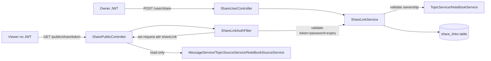

# Public Share Link — Topic & Notebook

Tính năng chia sẻ Topic/Notebook qua public link (read-only) cho người không có tài khoản.

## Tổng quan

- **Mục đích:** Owner chia sẻ Topic/Notebook với người khác qua link công khai. Ai có link (và biết password nếu có) mới truy cập được.
- **Quyền viewer:** Read-only — xem metadata, messages, sources, presigned download URL. **Không** chat/upload/feedback/edit/delete.
- **Bảo mật link:**
  - **Token:** 32 byte ngẫu nhiên (base64 URL-safe, ~43 ký tự), không đánh đoán được (`SecureRandom`).
  - **Password (tùy chọn):** BCrypt hash, null = không yêu cầu password.
  - **Expiry (tùy chọn):** null = vĩnh viễn, hoặc số ngày hết hạn (tối đa `share.maxExpiryDays`, mặc định 365).
  - **Revoke:** Owner hủy link bất cứ lúc nào (`revokedAt` set).
- **Auth:** Filter chain `/public/**` permitAll + `ShareLinkAuthFilter` xác thực token/password/expiry. **Không cần JWT.**

## Kiến trúc



## API Endpoints

### Owner APIs (`/user/share` — yêu cầu JWT)

| Method | Path | Mô tả |
|---|---|---|
| `POST` | `/user/share` | Tạo share link. Body: `{resourceType, resourceId, title?, password?, expiryDays?}` |
| `GET` | `/user/share` | List share link đã tạo. Filter: `resourceType`, `resourceId`, `activeOnly`, pagination |
| `DELETE` | `/user/share/{linkId}` | Revoke (hủy) link |
| `GET` | `/user/share/{linkId}/stats` | Thống kê view count |

### Public Viewer APIs (`/public/share` — không cần JWT)

| Method | Path | Mô tả |
|---|---|---|
| `GET` | `/public/share/{token}` | Metadata resource (title, description, ownerDisplayName, messageCount, sourceCount) |
| `GET` | `/public/share/{token}/messages?page=&size=` | List messages (phân trang) |
| `GET` | `/public/share/{token}/sources?page=&size=` | List sources (phân trang) |
| `GET` | `/public/share/{token}/sources/{sourceId}/download-url` | Presigned download URL cho source |

**Password:** Nếu link yêu cầu password, viewer gửi header `X-Share-Password: <password>` trên mỗi request. Filter trả 403 `SHARE_LINK_PASSWORD_REQUIRED` (thiếu) hoặc `SHARE_LINK_PASSWORD_INVALID` (sai) trước khi tới controller.

## Cấu hình (`application.yml`)

```yaml
share:
  base-url: ""              # Base URL build link (vd https://ai.example.com/share). Trống = chỉ trả token
  default-expiry-days:      # null = vĩnh viễn (mặc định)
  max-expiry-days: 365      # Giới hạn tối đa owner được đặt
  token-length: 32          # Byte (base64 URL-safe → ~43 ký tự)
```

## Cơ sở dữ liệu

Bảng `share_links` (Flyway `V16__create_share_links.sql`):

| Column | Type | Mô tả |
|---|---|---|
| `id` | UUID PK | |
| `token` | VARCHAR(64) UNIQUE | Token ngẫu nhiên 32 byte base64 URL-safe |
| `resource_type` | VARCHAR(32) | `TOPIC` / `NOTEBOOK` |
| `resource_id` | UUID | UUID Topic/Notebook |
| `owner_id` | UUID | UUID owner |
| `organization_id` | UUID | UUID org của owner lúc tạo |
| `title` | VARCHAR(256) | Mô tả link (nullable) |
| `password_hash` | VARCHAR(100) | BCrypt hash (nullable = không cần password) |
| `expires_at` | TIMESTAMP | Hết hạn (nullable = vĩnh viễn) |
| `revoked_at` | TIMESTAMP | Hủy (nullable = còn hiệu lực) |
| `view_count` | BIGINT | Tổng lượt xem (tăng nguyên tử) |
| `last_viewed_at` | TIMESTAMP | Xem gần nhất |
| `created_at/by`, `updated_at/by` | | AuditEmbed |

**Indexes:** `idx_share_links_token` (unique), `idx_share_links_resource` (resource_type, resource_id), `idx_share_links_owner` (owner_id).

## Error codes (ApiResponseStatus 1174–1180)

| Code | Enum | HTTP | Mô tả |
|---|---|---|---|
| 1174 | `SHARE_LINK_NOT_EXISTS` | 404 | Link không tồn tại |
| 1175 | `SHARE_LINK_EXPIRED` | 403 | Link đã hết hạn |
| 1176 | `SHARE_LINK_REVOKED` | 403 | Link đã bị hủy |
| 1177 | `SHARE_LINK_PASSWORD_REQUIRED` | 403 | Link yêu cầu password |
| 1178 | `SHARE_LINK_PASSWORD_INVALID` | 403 | Password sai |
| 1179 | `SHARE_LINK_RESOURCE_MISMATCH` | 400 | Loại resource không khớp |
| 1180 | `SHARE_LINK_RESOURCE_OWNER_ONLY` | 403 | Chỉ owner mới quản lý link |

## Files chính

| File | Vai trò |
|---|---|
| `entity/postgres/ShareLinkEntity.java` | Entity + helper `isRevoked`/`isExpired`/`isPasswordRequired` |
| `repository/ShareLinkRepository.java` | JPA + `findByToken`, `incrementViewCount` (native @Modifying) |
| `service/ShareLinkService.java` | Business logic: create/list/revoke/stats + public access |
| `security/ShareLinkAuthFilter.java` | Filter xác thực token/password/expiry cho `/public/share/**` |
| `controller/ShareUserController.java` | Owner APIs (`/user/share`) |
| `controller/SharePublicController.java` | Public viewer APIs (`/public/share`) |
| `mapper/ShareLinkMapper.java` | MapStruct entity → DTO |
| `dto/own/request/ShareLinkCreateRequestDto.java` | Request tạo link |
| `dto/own/request/filter/ShareLinkFilterDto.java` | Filter list link |
| `dto/own/response/ShareLinkResponseDto.java` | Response owner view |
| `dto/own/response/ShareLinkStatsDto.java` | Response stats |
| `dto/own/response/SharedResourceResponseDto.java` | Response public metadata |
| `enums/ShareResource.java` | `TOPIC`, `NOTEBOOK` |
| `db/migration/V16__create_share_links.sql` | Flyway migration |

## Service method overload pattern

Các service read method hiện có gọi `validateTopicOfUser`/`validateNoteBookOfUser` (ownership check via JWT). Cho public share flow, thêm overload `*Shared` **bỏ** ownership check:

- `TopicService#getEntityByIdShared` — get entity không validate owner
- `NoteBookService#getEntityByIdShared` — tương tự
- `MessageService#getAllShared(parentId, parentType, filter)` — wrapper `getAllInternal(..., validateOwnership=false)`
- `TopicSourceService#getSourcesShared` / `getSourceDownloadUrlShared`
- `NoteBookSourceService#getSourcesShared` / `getSourceDownloadUrlShared`

**Nguyên tắc:** Không sửa method cũ (giữ flow JWT nguyên vẹn), chỉ thêm method mới `*Shared`.

## Audit log

- `create`: `AuditAction.SHARE` trên `AuditResource.SHARE_LINK`
- `revoke`: `AuditAction.REVOKE` trên `AuditResource.SHARE_LINK`
- View (public): tùy chọn log `AuditAction.READ` (userId=null) — hiện skip để giảm noise

## Limitations / Further

- **Read-only viewer** — chat/upload ra sau nếu cần (cần cấp guest JWT)
- **Unique viewer tracking** — hiện chỉ `viewCount` (total). Nếu cần unique, thêm bảng `share_link_views`
- **Rate limit viewer** — chưa có. Có thể thêm per-IP rate limit trên `/public/share/**`
- **Token rotation** — chưa có. Owner revoke+create mới để đổi token
- **Share Draft/Note** — chưa hỗ trợ, chỉ Topic/Notebook