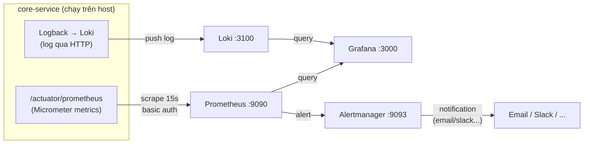

# Monitoring Stack — core-service

Bộ công cụ giám sát (observability) chạy local cho `core-service`, gồm 4 thành phần chính:

| Thành phần | Vai trò | Port | UI |
|-----------|---------|------|----|
| **Prometheus** | Thu thập & lưu trữ **metrics** (số liệu) | `9090` | http://localhost:9090 |
| **Grafana** | **Dashboard** trực quan + **Alerting** | `3000` | http://localhost:3000 |
| **Loki** | Thu thập & lưu trữ **logs** (nhật ký) | `3100` | http://localhost:3100 |
| **Alertmanager** | Nhận alert từ Prometheus, gửi **notification** | `9093` | http://localhost:9093 |

> Tài liệu chi tiết hơn: [`docs/monitoring-prometheus-grafana.md`](../docs/monitoring-prometheus-grafana.md)

---

## Kiến trúc tổng quan



**Luồng dữ liệu:**
1. **Metrics**: `core-service` expose metrics qua `/api/v1/actuator/prometheus` (Micrometer). Prometheus **kéo (scrape)** mỗi 15s.
2. **Logs**: ứng dụng gửi log tới Loki (qua Logback appender HTTP).
3. **Hiển thị**: Grafana query cả Prometheus (metrics) và Loki (logs) để vẽ dashboard.
4. **Cảnh báo**: Prometheus đánh giá alert rules → gửi sang Alertmanager → Alertmanager gửi notification.

---

## Cách chạy

```bash
# Từ thư mục gốc repo
docker compose -f monitoring/docker-compose.yml up -d

# Xem log
docker compose -f monitoring/docker-compose.yml logs -f

# Dừng
docker compose -f monitoring/docker-compose.yml down
```

> **Lưu ý:** `core-service` phải đang chạy **trên host** (không phải trong container) để Prometheus scrape được qua `host.docker.internal`.

---

## Cấu trúc thư mục

```
monitoring/
├── docker-compose.yml          # Định nghĩa 4 service + network + volumes
├── prometheus/
│   ├── prometheus.yml          # Cấu hình scrape + alerting + rule_files
│   └── rules/
│       └── core-service.yml    # Alert rules (app down, 5xx, latency, heap...)
├── grafana/
│   └── provisioning/           # Tự nạp khi Grafana khởi động
│       ├── datasources/        # Datasource Prometheus + Loki
│       ├── dashboards/         # Dashboard JSON (Spring Boot)
│       └── alerting/           # (chỉ hướng dẫn — alert tạo qua UI)
├── loki/
│   └── loki-config.yml         # Cấu hình Loki (dev, không auth)
└── alertmanager/
    └── alertmanager.yml        # Routing + receivers (hiện null receiver)
```

---

## Hướng dẫn từng module

- [**Prometheus**](./prometheus/README.md) — thu thập metrics, alert rules
- [**Grafana**](./grafana/README.md) — dashboard, datasource, alerting
- [**Loki**](./loki/README.md) — lưu trữ & truy vấn log
- [**Alertmanager**](./alertmanager/README.md) — routing & gửi notification

---

## Các biến môi trường quan trọng

| Biến | Mặc định | Ý nghĩa |
|------|---------|---------|
| `ACTUATOR_USER_PASSWORD` | `changeme` | Password basic auth để scrape `/actuator/prometheus` (phải khớp với app) |
| `PROMETHEUS_APP_PORT` | `8080` | Port core-service trên host (8081 khi chạy profile `win`) |

> **Production:** bắt buộc đổi `changeme` và đặt cùng giá trị với biến môi trường của `core-service`. Nên dùng `password_file` thay vì password trực tiếp trong `prometheus.yml`.
